# ZDS (Zig Data Structures)

[](https://github.com/asheshvidyut/zds/actions/workflows/test.yml)

A collection of high-performance data structures for Zig.

> [!NOTE]
> These data structures are **not thread-safe**. If you need to access them from multiple threads, you must use external synchronization (e.g., `std.Thread.Mutex`).


## Usage

Add `zds` to your project by running:

```bash
zig fetch --save git+https://github.com/asheshvidyut/zds
```

Then in your `build.zig`:

```zig
// Define the zds dependency
const zds = b.dependency("zds", .{
    .target = target,
    .optimize = optimize,
});
mod.addImport("zds", zds.module("zds"));
```

## Data Structures

- [SwissMap](#swissmap)
- [RBTree](#rbtree)
- [RadixTree](#radixtree)
- [BTree](#btree)
- [LRUCache](#lrucache)

## Benchmarks

- [SwissMap](#swissmap-1)
- [RBTree](#rbtree-1)
- [RadixTree](#radixtree-1)
- [BTree](#btree-1)
- [LRUCache](#lrucache-1)

## Examples

All examples are located in the `examples/` directory. You can run them using the `examples` step:

```bash
zig build examples
```

This will run all available example executables (e.g., `swissmap`, `rbtree`).

### SwissMap

A SIMD-optimized hash map based on SwissTable (Abseil).
- Uses Control Bytes and Group Probing (16-slot groups) for efficiency.
- Supports `SwissMap(K, V)` for easy use and `SwissMapWithOptions` for custom contexts and load factors.

```zig
const std = @import("std");
const zds = @import("zds");

// Simple usage: K, V
const SwissMap = zds.SwissMap(u32, []const u8);

// Advanced usage: Custom Context and Max Load Percentage
// const SwissMap = zds.SwissMapWithOptions(u32, []const u8, void, 50);

pub fn main() !void {
    var gpa = std.heap.GeneralPurposeAllocator(.{}){};
    defer _ = gpa.deinit();
    const allocator = gpa.allocator();

    // Initialize with allocator
    var map = SwissMap.init(allocator);
    defer map.deinit();

    // Insert
    try map.put(1, "Zig");
    try map.put(2, "Rocks");

    // Get
    if (map.get(1)) |val| {
        std.debug.print("Found: {s}\n", .{val});
    }

    // Delete (Remove)
    // Returns true if the key was found and removed
    if (map.remove(1)) {
        std.debug.print("Deleted key 1\n", .{});
    }

    // Iterate
    var it = map.iterator();
    while (it.next()) |entry| {
        std.debug.print("{d} -> {s}\n", .{entry.key_ptr.*, entry.value_ptr.*});
    }
}
```

### RBTree

A fully generic Red-Black Tree implementation that can be used as sorted maps or sorted sets.
- Supports `RBTree(K, V)` for easy use with default contexts.
- Supports `RBTreeWithOptions` for custom contexts (comparators).
- **Order Statistics**: Efficiently find the K-th smallest/largest element ($O(log N)$).
- **Range Queries**: `ceiling`, `floor`, `higher`, `lower` for precise range lookups.
- **Doubly Linked List Integration**: Nodes are linked for $O(1)$ step iteration and cache-friendly linear scans.

#### Usage

```zig
const std = @import("std");
const zds = @import("zds");

// Simple usage: K, V (void means set)
const Tree = zds.RBTree(u32, []const u8);

pub fn main() !void {
    var gpa = std.heap.GeneralPurposeAllocator(.{}){};
    defer _ = gpa.deinit();
    const allocator = gpa.allocator();

    var tree = Tree.init(allocator, .{});
    defer tree.deinit();

    // Insert
    try tree.insert(10, "Ten");
    try tree.insert(5, "Five");

    // Search
    if (tree.search(5)) |node| {
        std.debug.print("Found: {s}\n", .{node.value});
    }

    // Iterate (Sorted Order)
    var it = tree.iterator();
    while (it.next()) |node| {
        std.debug.print("{d} -> {s}\n", .{node.key, node.value});
    }

    // Delete
    _ = tree.delete(5);

    // Range Queries
    // ceiling(k): smallest key >= k
    if (tree.ceiling(9)) |n| std.debug.print("Ceiling 9: {d}\n", .{n.key});

    // floor(k): largest key <= k
    if (tree.floor(11)) |n| std.debug.print("Floor 11: {d}\n", .{n.key});

    // higher(k): smallest key > k
    if (tree.higher(10)) |n| std.debug.print("Higher 10: {d}\n", .{n.key});

    // lower(k): largest key < k
    if (tree.lower(10)) |n| std.debug.print("Lower 10: {d}\n", .{n.key});
}
```

#### Custom Context

```zig
const MyContext = struct {
    pub fn cmp(self: @This(), a: u32, b: u32) std.math.Order {
        _ = self;
        return std.math.order(b, a); // Descending order
    }
};
const DescTree = zds.RBTreeWithOptions(u32, void, MyContext);
```

### RadixTree

A mutable Radix Tree (Compact Prefix Tree) implementation.
- **Optimized for Strings**: Keys must be `[]const u8`. Nodes are split/merged to compress prefixes.
- **K-th Node Access**: Efficiently retrieve the K-th lexicographically ordered key ($O(L)$ using subtree counts).
- **Longest Prefix Match**: Find values associated with the longest matching prefix of a key.
- **Sparse Nodes**: Uses `RBTree` for edges, efficient for nodes with many children.
- **Doubly Linked Leaves**: Leaf nodes are linked in a global doubly linked list for O(1) step iteration.

#### Usage

```zig
const std = @import("std");
const zds = @import("zds");
const RadixTree = zds.RadixTree;

pub fn main() !void {
    var gpa = std.heap.GeneralPurposeAllocator(.{}){};
    defer _ = gpa.deinit();
    const allocator = gpa.allocator();

    var tree = try RadixTree([]const u8, i32).init(allocator);
    defer tree.deinit();

    // Insert
    try tree.insert("apple", 1);
    try tree.insert("app", 2);

    // Get
    if (tree.get("apple")) |v| {
        std.debug.print("Found: {d}\n", .{v});
    }

    // Longest Prefix
    if (tree.longestPrefix("applepie")) |v| {
        std.debug.print("Longest prefix val: {d}\n", .{v}); // 1 (apple)
    }

    // K-th Node (Order Statistics)
    if (tree.getAtIndex(0)) |v| {
        std.debug.print("1st key's value: {d}\n", .{v}); // 2 (app)
    }
}
```
### LRUCache

A generic Least Recently Used (LRU) cache.
- Combines `SwissMap` for O(1) access with a custom `DoublyLinkedList` for O(1) eviction.
- Optimized for memory reuse (recycling nodes).

#### Usage

```zig
const std = @import("std");
const zds = @import("zds");

pub fn main() !void {
    var gpa = std.heap.GeneralPurposeAllocator(.{}){};
    defer _ = gpa.deinit();
    const allocator = gpa.allocator();

    // Init with capacity 2
    var lru = try zds.LRUCache(u32, []const u8).init(allocator, 2);
    defer lru.deinit();

    try lru.put(1, "one");
    try lru.put(2, "two");
    
    // Access string "one", making it MRU
    if (lru.get(1)) |val| {
        std.debug.print("Got: {s}\n", .{val});
    }

    // Insert "three", evicting "two" (LRU)
    try lru.put(3, "three");
}
```


### BTree

A generic B-Tree implementation.
- Balanced tree structure optimized for minimizing disk/memory accesses.
- Configurable minimum degree `t` for tuning node size and cache usage.
- Supports `insert`, `search`, and `iterator`.

#### Usage

```zig
const std = @import("std");
const zds = @import("zds");

pub fn main() !void {
    const allocator = std.heap.page_allocator;

    // init(allocator, context, t)
    // t=32 implies nodes have between 31 and 63 keys.
    var tree = zds.BTree(u32, []const u8).init(allocator, .{}, 32);
    defer tree.deinit();

    try tree.insert(1, "one");
    try tree.insert(2, "two");

    if (tree.search(1)) |v| {
        std.debug.print("Found: {s}\n", .{v});
    }
}
```

## Benchmarks

Run benchmarks locally:

> [!NOTE]
> All benchmarks were run on macOS (Apple M4, 10 cores).

### SwissMap

```bash
zig build swissmap_bench
```

##### Benchmark Results

`zds.SwissMap` consistently outperforms `std.AutoHashMap`, especially for insertions and deletions. Below is a summary of the performance speedup at N=1,000,000 (Integer keys).

```mermaid
gantt
    title Speedup Factor (zds.SwissMap vs std.AutoHashMap)
    dateFormat X
    axisFormat %s
    section Speedups
    Put (1.6x)     : 0, 16
    Get (1.2x)     : 0, 12
    Iterate (0.9x) : 0, 9
    Remove (1.1x)  : 0, 11
```



<details>
<summary><strong>Detailed Results (Click to expand)</strong></summary>

#### Integer Benchmark Results
| N | Map | Put (ns) | Get (ns) | Iterate (ns) | Remove (ns) |
|---|---|---:|---:|---:|---:|
| 100 | std.AutoHashMap | 38,125 | 1,333 | 417 | 1,375 |
| 100 | zds.SwissMap | **28,041** | **625** | 541 | **1,000** |
| 1000 | std.AutoHashMap | 112,208 | 8,375 | 7,166 | 8,542 |
| 1000 | zds.SwissMap | **116,917** | **4,500** | 8,000 | **5,709** |
| 10000 | std.AutoHashMap | 545,833 | 94,917 | 54,875 | 121,292 |
| 10000 | zds.SwissMap | **396,333** | **62,584** | 61,709 | **173,750** |
| 100000 | std.AutoHashMap | 3,152,084 | 713,125 | 213,667 | 688,250 |
| 100000 | zds.SwissMap | **1,358,541** | **508,917** | 268,959 | **208,334** |
| 1000000 | std.AutoHashMap | 32,674,791 | 6,784,500 | 5,058,958 | 6,791,166 |
| 1000000 | zds.SwissMap | **20,144,375** | **5,641,791** | 5,677,875 | **5,975,500** |

#### String Benchmark Results (words.txt)
| Words | Map | Put (ns) | Get (ns) | Iterate (ns) | Remove (ns) |
|---|---|---:|---:|---:|---:|
| 369421 | std.StringMap | 13,725,916 | 4,957,667 | 1,038,083 | 4,076,292 |
| 369421 | zds.SwissMap | **7,918,667** | **4,874,542** | **1,035,583** | **2,913,042** |

#### UUID Benchmark Results
| Count | Map | Put (ns) | Get (ns) | Iterate (ns) | Remove (ns) |
|---|---|---:|---:|---:|---:|
| 100 | std.AutoHashMap | 16,125 | 1,000 | 334 | 1,000 |
| 100 | zds.SwissMap | **12,708** | **500** | **333** | 1,084 |
| 1000 | std.AutoHashMap | 54,750 | 6,375 | 5,167 | 6,125 |
| 1000 | zds.SwissMap | **46,208** | **2,750** | 5,167 | **3,125** |
| 10000 | std.AutoHashMap | 304,500 | 78,208 | 38,750 | 86,042 |
| 10000 | zds.SwissMap | **232,916** | **37,333** | 50,958 | **31,334** |
| 100000 | std.AutoHashMap | 2,747,542 | 1,059,541 | 238,708 | 969,917 |
| 100000 | zds.SwissMap | **1,802,209** | **462,750** | **231,458** | **429,250** |
| 1000000 | std.AutoHashMap | 40,498,625 | 14,394,625 | 5,223,584 | 13,673,709 |
| 1000000 | zds.SwissMap | **28,528,125** | **14,424,791** | 5,233,042 | **17,103,500** |

#### Point Struct Benchmark Results (x, y)
| Count | Map | Put (ns) | Get (ns) | Iterate (ns) | Remove (ns) |
|---|---|---:|---:|---:|---:|
| 100 | std.HashMap | 15,042 | 1,000 | 541 | 875 |
| 100 | zds.SwissMap | **13,667** | **416** | **334** | 958 |
| 1000 | std.HashMap | 43,833 | 5,334 | 5,500 | 5,166 |
| 1000 | zds.SwissMap | **37,917** | **1,875** | **5,208** | **2,417** |
| 10000 | std.HashMap | 230,417 | 61,958 | 39,542 | 60,083 |
| 10000 | zds.SwissMap | **176,041** | **19,458** | **37,083** | **20,875** |
| 100000 | std.HashMap | 2,088,666 | 854,959 | 263,208 | 844,041 |
| 100000 | zds.SwissMap | **1,393,458** | **302,125** | **227,916** | **276,125** |
| 1000000 | std.HashMap | 29,412,958 | 7,986,875 | 4,741,833 | 8,410,917 |
| 1000000 | zds.SwissMap | **22,265,959** | **7,892,834** | 5,168,417 | **7,084,125** |

#### Bad Hash Benchmark Results (Mod 1024 Collision)
Demonstrates resistance to collisions (Linear Probing vs Group Probing).

| Count | Map | Put (ns) | Get (ns) | Iterate (ns) | Remove (ns) |
|---|---|---:|---:|---:|---:|
| 100 | std.HashMap | 31,708 | 167 | 83 | 125 |
| 100 | zds.SwissMap | **15,958** | 125 | 125 | 292 |
| 1000 | std.HashMap | 27,208 | 666 | 750 | 666 |
| 1000 | zds.SwissMap | **25,916** | 708 | 792 | 958 |
| 10000 | std.HashMap | 34,894,000 | 23,923,084 | 7,250 | 22,426,375 |
| 10000 | zds.SwissMap | **20,693,042** | **18,773,000** | 11,917 | **1,665,791** |
| 100000 | std.HashMap | 3,162,917,417 | 2,361,168,333 | 52,792 | 2,275,636,125 |
| 100000 | zds.SwissMap | **2,189,782,833** | **2,096,713,417** | 59,542 | **184,464,125** |

</details>

### RBTree


```bash
zig build rbtree_bench
```

##### Benchmark Results

`zds.RBTree` is optimized for maintaining sorted order under heavy insertions/deletions. It is significantly faster than keeping an `ArrayList` sorted (~17x speedup at N=100k).

```mermaid
gantt
    title Speedup Factor (zds.RBTree vs Sorted ArrayList) at N=100k
    dateFormat X
    axisFormat %s
    section Speedups
    Insert (17x)   : 0, 17
    Remove (15x)   : 0, 15
    Search (0.6x)  : 0, 6
```



> [!NOTE]
> `Sorted ArrayList` has faster lookups (Search) due to CPU cache locality (contiguous memory), but insertion is $O(N)$. `RBTree` insertion is $O(\log N)$.

<details>
<summary><strong>Detailed RBTree Results (Click to expand)</strong></summary>

#### Integer Benchmark Results
| N | Tree | Insert (ns) | Search (ns) | Iterate (ns) | Remove (ns) |
|---|---|---:|---:|---:|---:|
| 100 | Sorted ArrayList | 11,792 | 2,708 | 83 | **2,959** |
| 100 | zds.RBTree | **8,958** | **2,417** | 125 | 8,334 |
| 1000 | Sorted ArrayList | **65,917** | 37,917 | 41 | **53,750** |
| 1000 | zds.RBTree | 79,333 | **36,334** | 1,500 | 73,500 |
| 10000 | Sorted ArrayList | 2,364,167 | **489,583** | 625 | 2,350,750 |
| 10000 | zds.RBTree | **1,096,292** | 664,916 | 77,542 | **1,127,333** |
| 100000 | Sorted ArrayList | 298,919,541 | **7,586,542** | 7,416 | 297,974,584 |
| 100000 | zds.RBTree | **17,229,667** | 10,536,916 | 3,548,500 | **18,373,167** |

#### String Benchmark Results (words.txt)
| Words | Tree | Insert (ns) | Search (ns) | Remove (ns) |
|---|---|---:|---:|---:|
| 369421 | Sorted ArrayList | **36,358,917** | 29,745,625 | 7,669,285,000 |
| 369421 | zds.RBTree | 103,439,750 | **24,437,958** | **149,908,709** |

> **Context**: `words.txt` is already sorted. `Sorted ArrayList` detects this ($O(1)$ append), but removal is $O(N^2)$ (~7.7s vs 0.15s for RBTree).

#### UUID Benchmark Results
| N | Tree | Insert (ns) | Search (ns) | Remove (ns) |
|---|---|---:|---:|---:|
| 100 | Sorted ArrayList | 16,875 | 2,542 | **2,792** |
| 100 | zds.RBTree | **9,208** | **2,333** | 7,709 |
| 1000 | Sorted ArrayList | 86,375 | **35,917** | **66,875** |
| 1000 | zds.RBTree | **72,625** | 37,292 | 84,958 |
| 10000 | Sorted ArrayList | 3,783,000 | **516,375** | 3,858,292 |
| 10000 | zds.RBTree | **1,001,209** | 592,000 | **1,012,541** |
| 100000 | Sorted ArrayList | 559,436,791 | **9,076,125** | 590,585,958 |
| 100000 | zds.RBTree | **18,692,792** | 14,065,125 | **22,643,667** |

</details>

### RadixTree

```bash
zig build radix_bench
```

##### Benchmark Results

`zds.RadixTree` offers efficient prefix-based storage and retrieval. While `Sorted ArrayList` is faster for raw binary search on small datasets due to cache locality, `RadixTree` excels at structure sharing and prefix operations.

> [!NOTE]
> `getAtIndex` (K-th node) is implemented in `O(L)` time using subtree counts. While slower than `Sorted ArrayList`'s `O(1)` random access, it provides order statistics without collecting all keys.

<details>
<summary><strong>Detailed RadixTree Results (Click to expand)</strong></summary>

#### String Benchmark Results
| Count | Structure | Insert (ns) | Search (ns) | Longest Prefix (ns) | Iterate (ns) |
|---|---|---:|---:|--------------------:|---:|
| 369421 | zds.RadixTree | 693,635,500 | 243,860,83 |      **19,151,917** | 1,283,291 |
| 369421 | Sorted ArrayList | **35,322,000** | **22,738,750** |          43,978,750 | **42** |
</details>


### LRUCache

```bash
zig build lru_bench
```

##### Benchmark Results (u32 keys, 1M ops)
| Count | Scenario | Time (ns) | Ns/Op |
|---|---|---:|---:|
| 500,000 | Fill (No Eviction) | 17,772,792 | 35 |
| 500,000 | Put (With Eviction) | 10,731,625 | **21** |
| 1,000,000 | Get (Random) | 21,783,834 | **21** |

> "Put (With Eviction)" is faster than "Fill" because it reuses existing nodes, avoiding memory allocation overhead.

### BTree

```bash
zig build btree_bench
```

##### Benchmark Results (N=1,000,000)

| Operation | Time (ns/op) |
|---|---:|
| Insert | 179 |
| Search | 67 |
| Iterate | 2 |